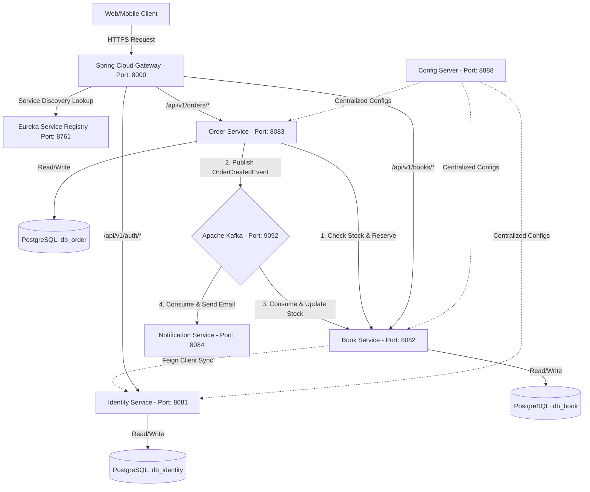

# 🌐 LỘ TRÌNH CHUYỂN ĐỔI MONOLITH SANG MICROSERVICES (CHUẨN SENIOR & SA)

Tài liệu này đóng vai trò là **ngữ cảnh trung tâm (Context Handoff & Architecture Blueprint)** để lưu trữ toàn bộ kiến thức, các bước thực thi, thiết kế hệ thống, và các tối ưu hóa chuẩn Enterprise khi chuyển đổi dự án **Bookstore API** hiện tại từ Monolith sang Microservices.

---

## 🛠️ PHẦN 1: BẢN THIẾT KẾ KIẾN TRÚC (ARCHITECTURAL BLUEPRINT)

### 1. Tại sao chuyển đổi và Đánh đổi (Trade-offs)
Trước khi bắt đầu gõ code, một **Software Architect (SA)** cần hiểu rõ lý do chuyển đổi và chi phí cơ hội.

| Đặc trưng | Monolith hiện tại | Microservices (Mục tiêu) | Đánh đổi & Giải pháp |
| :--- | :--- | :--- | :--- |
| **Cơ sở dữ liệu** | Single Database (PostgreSQL/H2). Join bảng dễ dàng. | Database-per-Service. Mỗi service sở hữu DB riêng. | Không thể JPA Join. Phải dùng API Composition hoặc CQRS. |
| **Giao dịch** | Local ACID Transactions (`@Transactional`). | Distributed Transactions. | Cực khó đảm bảo nhất quán dữ liệu. Phải dùng **Saga Pattern** + **Outbox Pattern**. |
| **Bảo mật** | Stateful Session hoặc Stateless JWT xử lý tập trung trong 1 app. | Distributed Auth. Xác thực tại Gateway hoặc Identity Service. | JWT decode lặp đi lặp lại. Giải pháp: Gateway xử lý Auth, chuyển Header xuống các downstream. |
| **Giao tiếp** | Gọi hàm trực tiếp (In-memory method calls). | Mạng (HTTP, gRPC, Message Broker). | Độ trễ (Network Latency) tăng. Phải tối ưu hóa kết nối, sử dụng gRPC cho Sync, Kafka cho Async. |

### 2. Sơ đồ kiến trúc tổng thể (Mermaid Diagram)



---

## 📚 PHẦN 2: LỘ TRÌNH HỌC TẬP & CÔNG NGHỆ BẮT BUỘC (STUDY ROADMAP)

Để làm việc như một Senior / SA trong hệ thống Microservices, bạn cần làm chủ 5 trụ cột công nghệ sau:

### Trụ cột 1: Service Discovery & Routing (Spring Cloud)
*   **Eureka Server/Client:** Hiểu cách các Service đăng ký IP/Port tự động và phát hiện nhau (Heartbeats, Lease Renewal).
*   **Spring Cloud Gateway:** Thiết kế các bộ lọc (Gateway Filters) để xử lý Auth (JWT Validation), Rate Limiting (bằng Redis Token Bucket), Global Logging, và Cors Configuration.
*   **Load Balancing (Spring Cloud LoadBalancer):** Cơ chế định tuyến Round-Robin giữa các instances của service.

### Trụ cột 2: Inter-Service Communication (Giao tiếp giữa các dịch vụ)
*   **Synchronous (Đồng bộ):**
    *   *OpenFeign:* Gọi REST API khai báo (Declarative HTTP client) gọn nhẹ, xử lý lỗi với `ErrorDecoder`.
    *   *gRPC & Protocol Buffers (protobuf):* Sử dụng HTTP/2 để truyền tải dữ liệu dạng binary siêu nhanh, tối ưu hóa Network Latency cho các tác vụ nội bộ (Internal RPCs).
*   **Asynchronous (Bất đồng bộ - Event-Driven):**
    *   *Apache Kafka:* Hiểu kiến trúc Partition, Consumer Group, Offset, và đảm bảo thứ tự của Event (Order Guarantees).
    *   *RabbitMQ:* Sử dụng AMQP với Exchange (Direct, Fanout, Topic) cho các logic định tuyến tin nhắn linh hoạt hơn.

### Trụ cột 3: Distributed Security (Bảo mật phân tán)
*   **OAuth2 & JWT:** Gateway đóng vai trò là Resource Server hoặc ủy thác xác thực (Token Relay).
*   **Internal Security:** Xác thực giữa các microservice bằng mTLS (mutual TLS) hoặc chèn mã Token bí mật (X-Internal-Token) vào Header để ngăn chặn Client gọi trực tiếp vào Service nằm trong mạng riêng (Private Subnet).

### Trụ cột 4: Distributed Transactions (Giao dịch phân tán)
*   **Saga Pattern:**
    *   *Choreography-based:* Các dịch vụ giao tiếp tự trị qua Kafka. Thích hợp cho hệ thống đơn giản, khớp nối lỏng (Loose Coupling).
    *   *Orchestration-based:* Dùng một Service trung tâm điều phối (Orchestrator) quản lý trạng thái. Thích hợp cho luồng nghiệp vụ phức tạp.
*   **Outbox Pattern:** Đảm bảo tính nhất quán giữa việc lưu Database và gửi Event ra Kafka (Tránh tình trạng DB lưu thành công nhưng Kafka mất kết nối hoặc ngược lại).
*   **Idempotency (Tính luỹ đẳng):** Thiết kế API và Consumer sao cho khi nhận cùng một yêu cầu/event nhiều lần thì kết quả không thay đổi.

### Trụ cột 5: Observability & Resilience (Khả năng giám sát & Chịu lỗi)
*   **Resilience4j:** Triển khai Circuit Breaker (Ngắt mạch khi downstream sập), Retry (Thử lại), Rate Limiter, Bulkhead.
*   **Distributed Tracing:** Sử dụng **Micrometer Tracing** (thay thế cho Spring Cloud Sleuth trong Spring Boot 3) phối hợp với **Zipkin** hoặc **Jaeger** để đính kèm `traceId` và `spanId` xuyên suốt tất cả các API calls.
*   **Centralized Logging & Metrics:** ELK Stack (Elasticsearch, Logstash, Kibana) hoặc Grafana LGTM Stack (Loki, Grafana, Tempo, Mimir) + Prometheus.

---

## 🗺️ PHẦN 3: KẾ HOẠCH DI CƯ CHI TIẾT DỰ ÁN BOOKSTORE (STEP-BY-STEP MIGRATION)

### 🚀 BƯỚC 1: PHÂN TÍCH RÀNH MẠCH KIẾN TRÚC HIỆN TẠI (MONOLITH DECOMPOSITION)
Chúng ta sẽ tách hệ thống hiện tại thành 3 Microservices chính và 2 Infrastructure Services:
1.  **Eureka Server** (Infrastructure)
2.  **API Gateway** (Infrastructure)
3.  **Identity Service** (Tách từ `auth`, `user`, `role`, `permission`, `config/SecurityConfig.java`)
4.  **Book (Catalog) Service** (Tách từ `book`, `category`)
5.  **Order Service** (Tách từ `order` và kết nối bất đồng bộ qua Kafka)

---

### 🚀 BƯỚC 2: KHỞI TẠO CẤU TRÚC MULTI-MODULE MAVEN (ENTERPRISE STANDARD)
Trong môi trường doanh nghiệp, để quản lý nhiều microservice một cách đồng bộ, ta sử dụng cấu trúc Maven Multi-Module để chia sẻ thư viện dùng chung (như common exception, dto wrapper).

Sơ đồ thư mục:
```text
microservice/ (Parent POM)
├── pom.xml
├── common-library/ (Dùng chung cho các Service: DTOs, Exception Handler, Utils)
│   └── pom.xml
├── eureka-server/
│   └── pom.xml
├── api-gateway/
│   └── pom.xml
├── identity-service/
│   └── pom.xml
├── book-service/
│   └── pom.xml
└── order-service/
    └── pom.xml
```

---

### 🚀 BƯỚC 3: THIẾT KẾ DATA DECOMPOSITION CHO LUỒNG ĐẶT HÀNG (ORDER WORKFLOW)

#### ❌ Hiện trạng Monolith (JPA Join & Local Transaction)
Trong file [OrderServiceImpl.java](file:///Users/thanvinh/Desktop/restaurant/microservice/src/main/java/com/example/bookstore/order/OrderServiceImpl.java#L39-L83), nghiệp vụ được thực hiện trong một Transaction cục bộ:
1. Tìm User bằng JPA.
2. Tìm Book bằng JPA.
3. Trừ kho trực tiếp trên thực thể Book: `book.setStock(...)`.
4. Tạo Order liên kết chặt chẽ với User và Book qua `@ManyToOne`.
5. Lưu cả Book và Order vào cùng 1 Database.

#### 🎯 Kiến trúc Microservices (Distributed Transaction với Saga & Outbox)
Khi tách ra, `Book` nằm ở DB_Book, `Order` nằm ở DB_Order. Ta không thể gọi `@ManyToOne` hay `@Transactional`.

Quy trình thiết kế chuẩn SA:
1. **API Gateway** nhận request đặt hàng từ Client, kiểm tra JWT, lấy `userId` từ token và chuyển vào Header `X-User-Id` để gửi xuống **Order Service**.
2. **Order Service** nhận request `placeOrder(bookId, quantity)`.
   *   Tạo bản ghi `Order` với trạng thái `PENDING`.
   *   Tạo một bản ghi trong bảng `OutboxTable` (lưu trữ Event dạng JSON).
   *   Cả hai hành động trên nằm chung một `@Transactional` cục bộ tại DB_Order. (Đảm bảo chắc chắn đơn hàng được tạo và Event được ghi lại).
3. **Transaction Outbox Worker** (hoặc Debezium CDC):
   *   Đọc từ bảng `OutboxTable` các event chưa gửi, publish vào Kafka topic `order-events` rồi cập nhật trạng thái đã gửi trong Outbox.
4. **Book Service** lắng nghe topic `order-events`:
   *   Nhận thông tin đặt hàng, kiểm tra và trừ kho (Stock Deduct).
   *   Nếu trừ kho thành công, gửi event `stock-reserved-event` về Kafka.
   *   Nếu hết hàng, gửi event `stock-reservation-failed-event` về Kafka.
5. **Order Service** lắng nghe kết quả:
   *   Nếu nhận `stock-reserved-event` -> Cập nhật trạng thái Order thành `COMPLETED`. Gửi tiếp event sang Notification Service để báo cho khách hàng qua Email.
   *   Nếu nhận `stock-reservation-failed-event` (Saga Compensation) -> Cập nhật trạng thái Order thành `FAILED`. Hoàn trả lại tiền (nếu đã thanh toán).

---

## 💡 HỌC PHẦN THỰC HÀNH: TỪNG BƯỚC MỘT (STEP-BY-STEP TUTORIAL)

Để giúp bạn tiếp cận dễ dàng nhất và không bị ngợp bởi lượng kiến thức khổng lồ, chúng ta sẽ chia quá trình thực hành thành các chặng (Milestones). Tôi sẽ dẫn dắt bạn qua từng chặng một. Sau mỗi chặng, bạn sẽ chạy thử nghiệm để kiểm chứng độ chính xác.

### 🏁 Chặng 1: Chuẩn bị Common Library và Cấu trúc Parent POM
Chúng ta sẽ refactor lại `pom.xml` gốc thành Parent POM và tạo module `common-library` để chứa các class dùng chung như `ApiResponse.java`, các Custom Exception nhằm tránh lặp code (DRY Principle) sau này.

### 🏁 Chặng 2: Dựng Eureka Discovery Server & Spring Cloud Gateway
Chúng ta sẽ viết mã nguồn cho 2 hạ tầng này để mở đường cho việc định tuyến và khám phá dịch vụ.

### 🏁 Chặng 3: Trích xuất Identity Service & Cấu hình Centralized Security
Tách phần User, Role, Permission và cơ chế JWT Token ra một service riêng biệt. Gateway sẽ làm nhiệm vụ xác thực token này trước khi cho phép request đi tiếp.

### 🏁 Chặng 4: Trích xuất Book Service & Catalog
Dịch vụ quản lý sách và kho hàng, độc lập DB.

### 🏁 Chặng 5: Trích xuất Order Service & Triển khai Kafka Event-Driven
Hiện thực hóa luồng đặt hàng phi đồng bộ và nhất quán dữ liệu cuối cùng (Eventual Consistency) qua Kafka.

---

> [!IMPORTANT]
> **HƯỚNG DẪN CỦA SA DÀNH CHO BẠN:**
> Hãy tập trung hoàn thành **Chặng 1 & Chặng 2** trước. Tôi sẽ trực tiếp tạo cấu trúc thư mục, di chuyển các Class cần thiết của Common, viết cấu hình Maven, và thiết lập Eureka Server + API Gateway ngay sau khi bạn đồng ý với kế hoạch hành động dưới đây.
